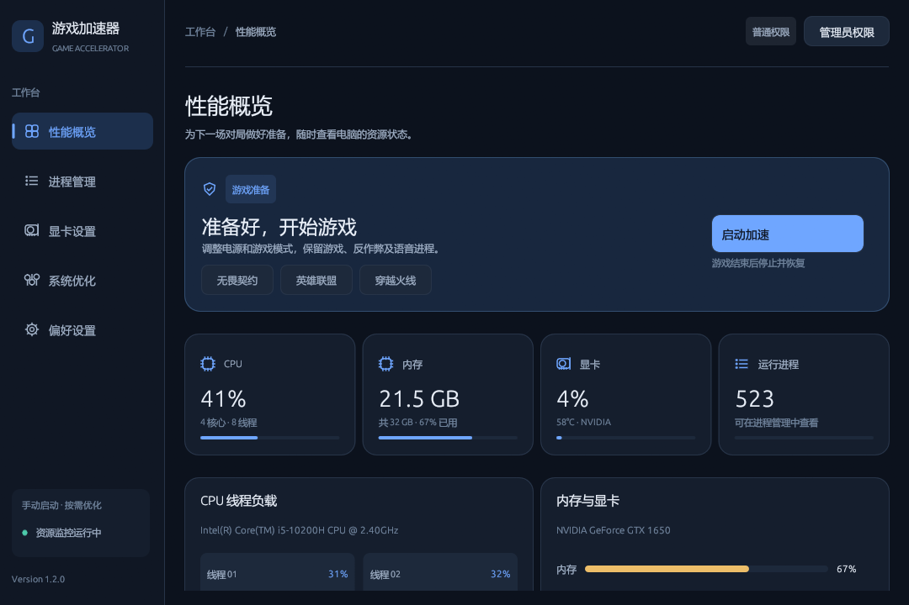

# Game Accelerator · 游戏加速器

Windows 10/11 本机资源与游戏设置管理工具，使用 Rust 和 egui。当前本地源码版本为 **1.2.0**，提供无畏契约、英雄联盟、穿越火线预设。

[English](README.en.md) · [GitHub Releases](https://github.com/zhang-forever/Game-Accelerator/releases) · [MIT](LICENSE)

1.2.0 采用统一的深色蓝灰界面。「性能概览」首页集中显示游戏预设、会话入口和等宽资源卡；「进程管理」提供分类概览与进程列表两种视图。「偏好设置」的保存与恢复默认按钮固定在底部。默认窗口为 1080×720，最小支持 880×560，页面内容可滚动查看。



## 在自己的电脑上试用

如果已拿到便携包，完整解压到自己可写的目录，双击 `GameAccelerator\Start.cmd`。配置保存在同目录的 `data` 中；启动时使用普通用户权限，需要额外权限的操作可通过界面里的管理员按钮请求 UAC。

从本仓库运行：

1. 准备 Windows x64、Rust MSVC 工具链、Visual Studio C++ Build Tools 和 Windows SDK。
2. 双击仓库根目录的 `run-local.cmd`。首次运行会编译并生成 `dist\GameAccelerator`；完成后打开界面。也可以在 PowerShell 中运行：

   ```powershell
   .\run-local.cmd
   ```

3. 在「性能概览」首页或「偏好设置」中选择游戏预设，先保留默认开关。点击「启动加速」，游戏期间保持软件运行。
4. 游戏结束后点击「停止并恢复原设置」或正常关闭软件，恢复本次会话修改前的电源计划和 Windows 游戏模式。查看状态提示确认操作结果。

本地源码可构建 1.2.0 的便携包，GitHub 下载文件与版本以 Releases 的实际附件为准。旧版 v1.0.0 的 EXE 不包含本文的会话恢复和默认行为。当前流程不要求 MSI 安装包。

## 默认行为与恢复范围

默认启用 Windows 游戏模式和高性能电源计划，**默认关闭结束后台进程**。全进程内存裁剪和自动游戏优先级调整已禁用。游戏预设用于识别游戏进程，可按实际安装情况编辑。

| 操作 | 何时执行 | 停止或退出后的行为 |
|------|----------|--------------------|
| 会话内电源计划与游戏模式 | 手动启动加速后 | 尝试恢复启动加速前的设置；失败会显示原因 |
| 后台进程关闭 | 用户启用该选项，或在进程页手动操作 | 已关闭的程序不会自动重启，未保存内容不能恢复 |
| 全进程内存裁剪 | 已禁用 | 不执行全系统进程裁剪 |
| 自动游戏优先级调整 | 已禁用 | 不改变游戏进程优先级 |
| 「系统优化」「显卡设置」页手动修改 | 用户点击对应开关或按钮 | 会持续保留，部分需要重启；不属于会话自动恢复范围 |

正常停止或退出会执行会话恢复。强制结束进程、断电或程序崩溃时，恢复不能保证完成；检查 Windows 的电源与游戏模式设置。高性能电源可能增加耗电、风扇噪声和温度，按电脑实际负载选择。

该工具管理本机资源与 Windows 设置。帧率和联机延迟效果需要在实际电脑和游戏中测量，项目没有游戏厂商的反作弊兼容认证。首次试用三款竞技游戏时保持默认选项。

## 功能与输入要求

- 「性能概览」显示 CPU、内存、显卡和进程信息；NVIDIA GPU 使用率、温度和显存信息依赖可用的 `nvidia-smi`，其他显卡可能没有这些读数。
- 「进程管理」支持分类概览与进程列表，保留搜索、排序和关闭前确认。结束前保存对应应用中的工作，系统保护列表并不保证每个第三方应用都可关闭。
- 「系统优化」提供电源、游戏模式等手动设置；界面会报告权限或系统功能不可用的情况。
- 游戏进程识别可输入 **EXE 文件名或完整路径**，例如 `VALORANT-Win64-Shipping.exe`。
- Windows GPU 首选项必须输入 **已经存在的 EXE 绝对路径**，例如 `E:\Games\Example\game.exe`。只写文件名不能正确定位 Windows 的每应用显卡设置。
- Windows GPU 首选项取决于显卡、驱动和 Windows 支持，按界面实际结果判断。CPU 核心停车修改、NVIDIA PowerMizer 注册表修改和遥测任务停用已移除或停用。软件不会自动启动游戏。

## 本地构建与便携包

```powershell
git clone https://github.com/zhang-forever/Game-Accelerator.git
cd Game-Accelerator
powershell.exe -NoProfile -ExecutionPolicy Bypass -File .\scripts\build-local.ps1
```

脚本使用 `cargo build --locked --release`，不安装工具、不修改系统设置，保留用户的 `CARGO_HOME` 等环境配置。已有发布构建时可只打包：

```powershell
powershell.exe -NoProfile -ExecutionPolicy Bypass -File .\scripts\build-local.ps1 -SkipBuild
```

默认读取 `target\release\game-accelerator.exe`；设置 `CARGO_TARGET_DIR` 时使用对应目录。可用 `-OutputDirectory <目录>` 指定输出位置，相对路径以仓库根目录为准。默认输出包括：

```text
dist/
├── GameAccelerator/
│   ├── game-accelerator.exe
│   ├── Start.cmd
│   ├── Diagnostics.cmd
│   ├── 使用说明.txt
│   └── SHA256SUMS.txt
├── GameAccelerator-1.2.0-windows-x64.zip
└── GameAccelerator-1.2.0-windows-x64.zip.sha256
```

打包不会清空已有目录；便携包仅包含上述分发文件，不打包使用时生成的 `data` 配置或诊断报告。可用 `Get-FileHash -Algorithm SHA256` 核对 ZIP 与 EXE 的校验值。

直接双击 EXE 也可以运行，配置默认使用用户的配置目录。`Start.cmd` 指定 `--config-dir "%~dp0data"`，让便携包使用独立配置。没有自动托盘或启动时自动加速功能。

仓库保留 `wix/main.wxs` 作为安装包开发参考；MSI 需要额外的 WiX 构建环境，当前 CI 和本地交付流程只验证 EXE 与便携 ZIP。

## 诊断与常见问题

双击便携目录里的 `Diagnostics.cmd`，等待完成。成功后生成 `data\diagnostics.toml`，失败时显示退出码。诊断读取系统状态并写入报告，不启动加速，不调整电源、注册表、服务或进程。命令行入口为 `game-accelerator.exe --diagnose <报告文件>`，可配合 `--config-dir <目录>`；普通 GUI 使用不需要这些参数。脚本使用 `start /wait` 等待 GUI 子系统的 EXE 完成，以读取真实退出码。

| 问题 | 处理方式 |
|------|----------|
| 首次运行提示找不到 Cargo、链接器或 SDK | 安装 Rust MSVC 工具链与 Visual Studio C++ Build Tools/Windows SDK，重新打开终端再运行；已构建的便携包无需编译环境 |
| 无法写入配置或诊断报告 | 将整个便携目录移到自己的可写目录，避免直接在压缩包或受保护的安装目录中运行 |
| 操作显示权限不足 | 先查看具体失败项；确需权限时用界面的管理员按钮重新启动，留意 UAC 提示 |
| 游戏进程未找到 | 先启动游戏，再核对实际游戏 EXE；启动器名称与游戏进程可能不同 |
| 「显卡设置」没有温度或占用率 | 检查 NVIDIA 驱动与 `nvidia-smi` 是否可用；无此工具时仍可使用 CPU/内存监控 |
| 停止后某项设置没有恢复 | 查看恢复错误；手动页修改与关闭程序本来就不在自动恢复范围内 |

## 开发与验证

```powershell
cargo fmt --all -- --check
cargo clippy --locked --all-targets --release -- -W clippy::all
cargo test --locked --release
cargo build --locked --release
```

本机可运行 `game-accelerator.exe --smoke-test <directory>`，使用真实 egui 渲染器保存六张 PNG：五个页面以及进程列表视图，并生成 `report.toml`。测试过滤交互输入，保留正常界面的视觉状态；不启动加速、不保存配置，也不调整电源、注册表、服务或进程。例如：

```powershell
.\target\release\game-accelerator.exe --smoke-test .\ui-smoke
.\target\release\game-accelerator.exe --window-size 880x560 --smoke-test .\ui-smoke-small
```

`--window-size <宽x高>` 可指定初始窗口尺寸。上面的第二条命令用于检查最小窗口布局。截图文件为 `dashboard.png`、`settings.png`、`gpu.png`、`system.png`、`processes.png` 和 `process-list.png`。

CI 执行这些检查、只读诊断和便携包构建，上传 ZIP 及校验文件。版本标签工作流会构建并发布 EXE、ZIP 和校验文件；修改工作流本身不会发布新版本。

主要目录：`src/app.rs` 管理界面与会话，`src/config` 保存配置，`src/core` 封装系统操作，`src/monitor` 采集监控数据，`src/ui` 提供各页面，`scripts/build-local.ps1` 生成本地交付物。

问题反馈请附版本、Windows 版本、失败动作与状态提示；诊断报告可帮助定位系统与权限问题。

## 许可证

[MIT](LICENSE) © 2026 mi
